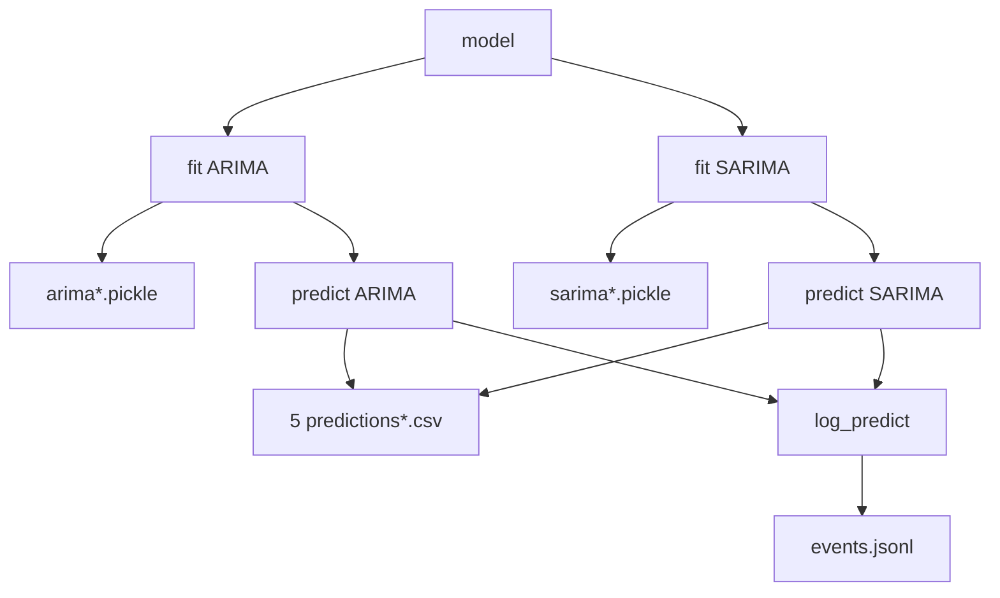

# Downstreams

## Forecasting output

The `model()` function in `forecasting.arima` produces two kinds of output:

1. **CSV prediction file** — `5 predictions[_<country>].csv` written to
   `DIRECTORY_OUTPUT`.
2. **Return value** — `{"arima": <sum>, "sarima": <sum>}` dict passed back
   to callers (the Flask `/predict` endpoint).

## Model artefacts

Trained ARIMA and SARIMA models are persisted as pickle files in
`DIRECTORY_MODELS`. The naming convention is:

| Model | Country-specific | Global |
|---|---|---|
| ARIMA | `arima_<country>.pickle` | `arima.pickle` |
| SARIMA | `sarima_<country>.pickle` | `sarima.pickle` |

On subsequent calls, `model()` loads the existing pickle via
`statsmodels.iolib.smpickle.load_pickle` instead of re-training.

## Event logs

Structured JSONL records are written to `<DIRECTORY_LOGS>/events.jsonl` by:

- `log_ingest()` — after ingestion completes.
- `log_train()` — after each model training run.
- `log_predict()` — after each prediction.

The `/logs` endpoint in `service.api` reads this file and filters records by
`event_type` (`ingest`, `train`, or `predict`).

*The forecasting pipeline writes pickles, prediction CSVs, and JSONL log
entries.*
