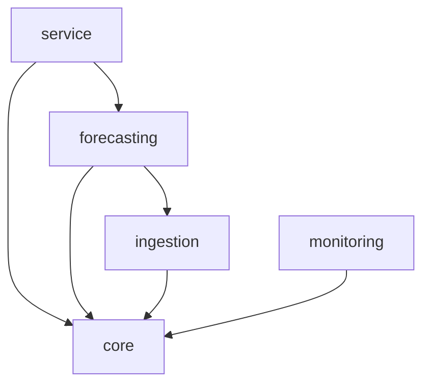

# Implementation Design

## Architecture overview

The service is structured as a layered Python package under
`src/ai_enterprise_workflow/`:

```
ai_enterprise_workflow/
├── core/           # Config singleton and structured event logging
├── ingestion/      # Invoice JSON → cleaned CSV pipeline
├── forecasting/    # ARIMA / SARIMA training and prediction
├── monitoring/     # Drift detection (Wasserstein distance bootstrap)
└── service/        # Flask REST API
```

## Module boundaries

| Module | Responsibility | Public surface |
|---|---|---|
| `core.config` | Typed settings via pydantic-settings | `AppSettings`, `cfg` singleton |
| `core.log_events` | Structured JSONL event logging | `get_logger`, `setup_logging`, `log_ingest`, `log_train`, `log_predict` |
| `ingestion.pipeline` | Load, clean, prepare, aggregate invoices | `ingest()` |
| `forecasting.arima` | ARIMA/SARIMA training and prediction | `model()` |
| `monitoring.drift` | Wasserstein-distance drift detection | `get_wasserstain_distance()` |
| `service.api` | Flask endpoints `/healthz`, `/predict`, `/logs` | `app` Flask instance |

## Dependency graph



*Module-layer boundaries enforced by `tach.toml`.*

## Design decisions

- **pydantic-settings for config:** `AppSettings` uses `BaseSettings` with
  `validation_alias` so each field can be overridden by a distinct env var
  while the Python attribute name follows snake_case conventions.
- **`core.log_events` instead of `core.logging`:** The name `logging.py`
  would shadow the stdlib `logging` module, causing import errors. The
  rename to `log_events.py` avoids the shadow.
- **Module-level path aliases (`DIRECTORY_INPUT`, etc.):** Each module that
  reads from `cfg` exposes aliases at module scope so tests can monkeypatch
  them with `monkeypatch.setattr` without constructing a new settings object.
