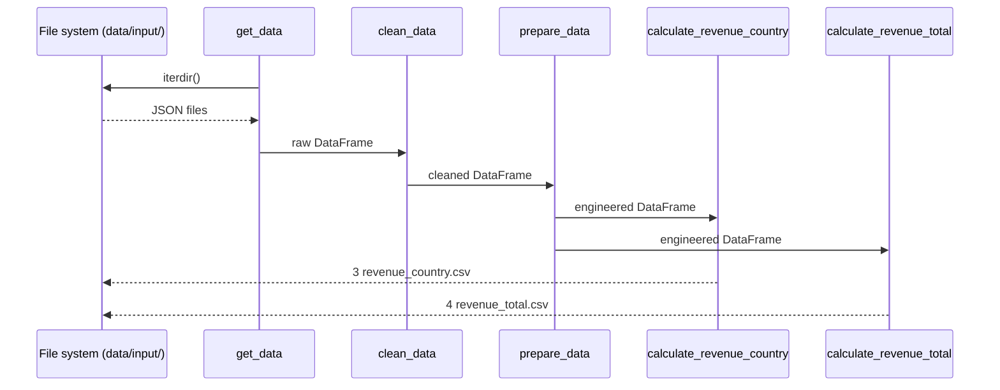

# Upstreams

## Data sources

The service consumes raw invoice JSON files placed in `data/input/` (or the
directory configured by `DIRECTORY_INPUT`).

Each file contains an array of invoice transaction objects. The ingestion
pipeline normalises the column names using `cfg.KEY_NAMES` and coerces types
using `cfg.KEY_TYPES`.

## Loading

`get_data()` iterates over every file in `directory_data`, reads each into a
pandas DataFrame, renames columns, and concatenates them into a single frame.

## Cleaning

`clean_data()` applies the following transformations in order:

1. Drop duplicate rows.
2. Fill NaN values with `-1`.
3. Strip non-digit characters from `invoice_id` and `stream_id`.
4. Replace whitespace-only strings with `-1`.
5. Cast each column to the type specified in `cfg.KEY_TYPES`.

## Feature engineering

`prepare_data()` derives a `date` column from `year`/`month`/`day`, drops
time and ID columns, and removes rows with negative price.

## Aggregation

Two aggregation steps produce the files consumed by forecasting:

- `calculate_revenue_country()` → `3 revenue_country.csv`
- `calculate_revenue_total()` → `4 revenue_total.csv`

*The ingestion pipeline reads from the file system and writes structured CSVs.*
