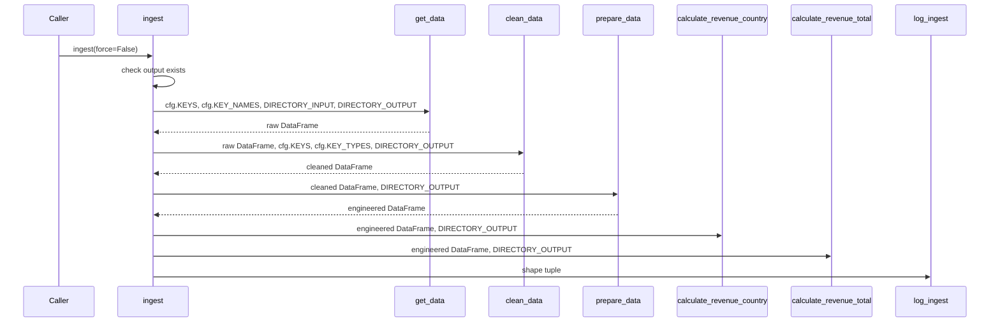
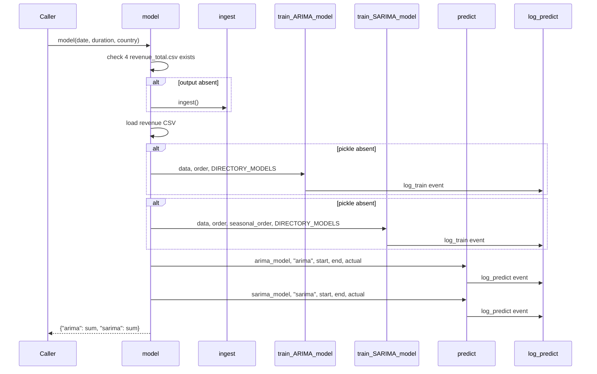
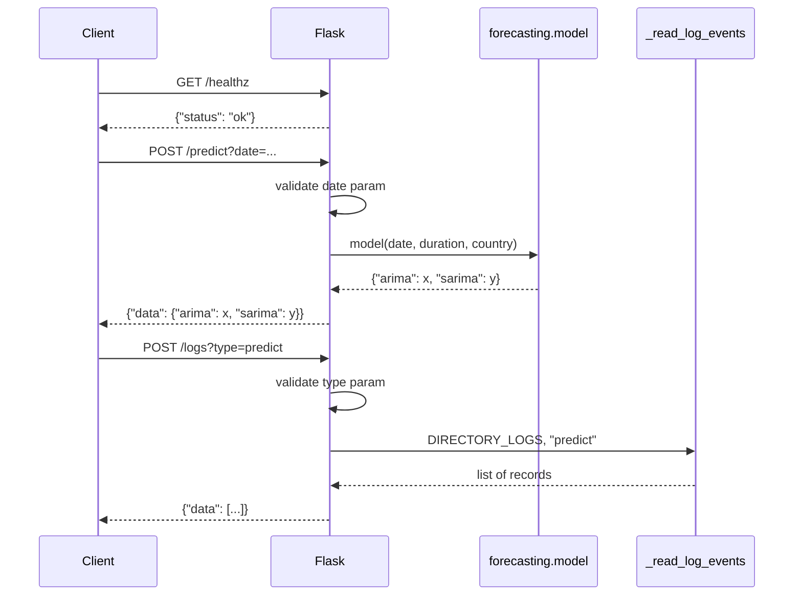

# Workflows

## Ingestion workflow

**Entry point:** `ingest()` in `ai_enterprise_workflow.ingestion.pipeline`.

**High-level:** See [How To → Ingestion](../how_to/ingestion.md).



*`ingest()` orchestrates all five pipeline steps and emits a structured log
event on completion.*

---

## Forecast workflow

**Entry point:** `model()` in `ai_enterprise_workflow.forecasting.arima`.

**High-level:** See [How To → Deployment](../how_to/deployment.md) for
end-to-end service usage.



*`model()` auto-triggers ingestion if outputs are absent, trains or loads
pickled models, runs both ARIMA and SARIMA predictions, and emits log events.*

---

## Flask API workflow

**Entry points:** `healthz()`, `predict()`, `logs()` in
`ai_enterprise_workflow.service.api`.



*The Flask API validates request parameters, delegates to domain functions,
and returns JSON responses.*

---

## Logging setup workflow

**Entry point:** `setup_logging()` in `ai_enterprise_workflow.core.log_events`.

Called once at process start in `run.py`:

```python
setup_logging(log_dir=cfg.directory_logs)
```

`setup_logging()` attaches:

1. A `StreamHandler` with plain-text formatter (always).
2. A `FileHandler` writing JSONL to `<log_dir>/events.jsonl` (when `log_dir`
   is provided).

Subsequent `log_ingest()`, `log_train()`, and `log_predict()` calls emit INFO
records on the package logger, which are handled by both handlers.
