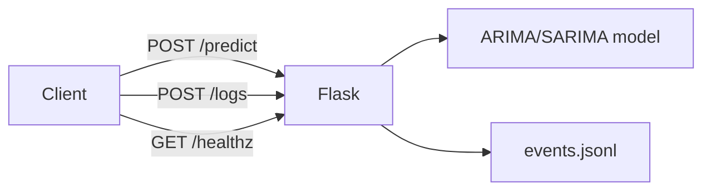

# Deployment

## What it is

The service is packaged as a Docker image and exposes a Flask REST API on
port 80 with `/healthz`, `/predict`, and `/logs` endpoints.

## When to use it

Deploy when you need to serve real-time revenue forecasts or query event logs
via HTTP.

## Minimal example

### Docker

```bash
docker build -t ai-enterprise-workflow .
docker run -p 80:80 ai-enterprise-workflow
```

### Direct (development)

```bash
python run.py
```

## High-level diagram



*Clients interact with the Flask service over HTTP; the service delegates to
the forecasting module and reads JSONL event logs.*

## See also

- [Advanced → Workflows](../advanced/workflows.md)
