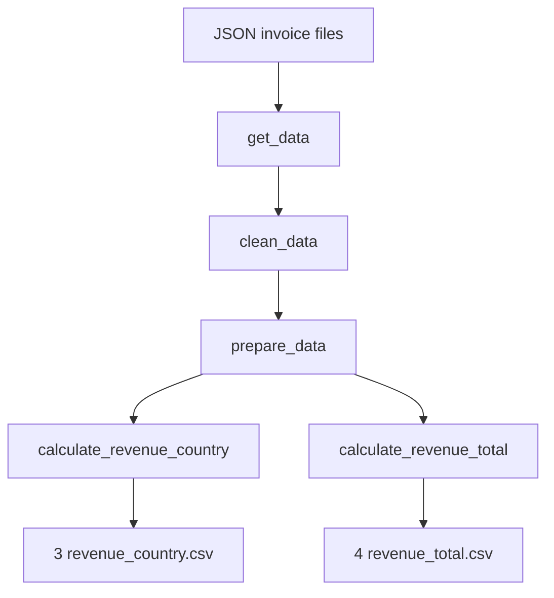

# Ingestion

## What it is

The ingestion pipeline reads raw invoice JSON files, applies cleaning
transformations, engineers features, and aggregates revenue by country and
date into CSV outputs.

## When to use it

Run ingestion before any forecasting step. It is also triggered automatically
by the `model()` function when the output files are absent.

## Minimal example

```python
from ai_enterprise_workflow.ingestion import ingest

ingest()  # Writes 5 CSVs to data/output/
```

Force a re-run even when outputs already exist:

```python
ingest(force=True)
```

## Embedded usage

```python
# From a pipeline script
from ai_enterprise_workflow.ingestion.pipeline import (
    get_data, clean_data, prepare_data,
    calculate_revenue_country, calculate_revenue_total,
)
from ai_enterprise_workflow.core.config import cfg

data = get_data(cfg.KEYS, cfg.KEY_NAMES, cfg.directory_input, cfg.directory_output)
data = clean_data(data, cfg.KEYS, cfg.KEY_TYPES, cfg.directory_output)
data = prepare_data(data, cfg.directory_output)
calculate_revenue_country(data, cfg.directory_output)
calculate_revenue_total(data, cfg.directory_output)
```

## High-level diagram



*The ingestion pipeline reads raw JSON files and emits five structured CSVs.*

## See also

- [Advanced → Upstreams](../advanced/upstreams.md)
- [API Reference](../api_reference.md)
